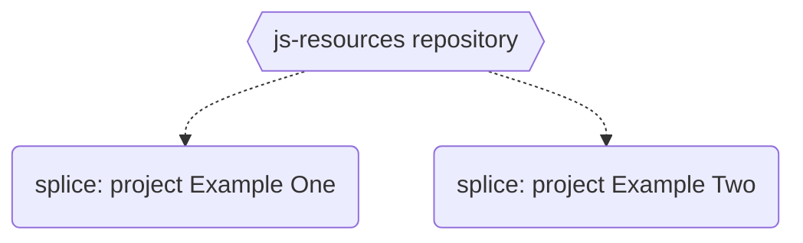

### JS resources
JavaScript resources and source codes for videos on [Code with Neck](https://www.youtube.com/channel/UC-5HS-AeihwNU6s8tCVWuVw) :tv: YouTube channel.

### Find more about author
- :hand: [buy me a coffee](https://www.buymeacoffee.com/neck)
- :bell: [YouTube](https://www.youtube.com/channel/UC-5HS-AeihwNU6s8tCVWuVw): Code with Neck
- :+1: [Twitter](https://twitter.com/Nechir89)
- :v: [Linkedin](https://www.linkedin.com/in/neck2019/)

### Resources
- JavaScript **splice** array function: [project example one](https://github.com/Nechir-89/spliceExample1) 
- JavaScript **splice** array function: [project example two](https://github.com/Nechir-89/spliceExample2)
- [YouTube Video]() for both JavaScript splice project examples

### Resources Graph

### References
- :book: [MDN JS splice method](https://developer.mozilla.org/en-US/docs/Web/JavaScript/Reference/Global_Objects/Array/splice)
