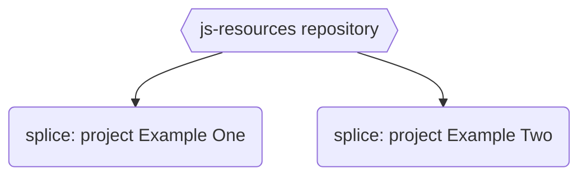

### JS resources
JavaScript resources and source codes for videos on [Code with Neck](https://www.youtube.com/channel/UC-5HS-AeihwNU6s8tCVWuVw) :tv: YouTube channel.

### Resources
- JavaScript **splice** array function: [project example one](https://github.com/Nechir-89/spliceExample1) 
- JavaScript **splice** array function: [project example two](https://github.com/Nechir-89/spliceExample2)
- [YouTube Video]() for both JavaScript splice project examples

### Rferences
- [MDN JS splice method](https://developer.mozilla.org/en-US/docs/Web/JavaScript/Reference/Global_Objects/Array/splice)
